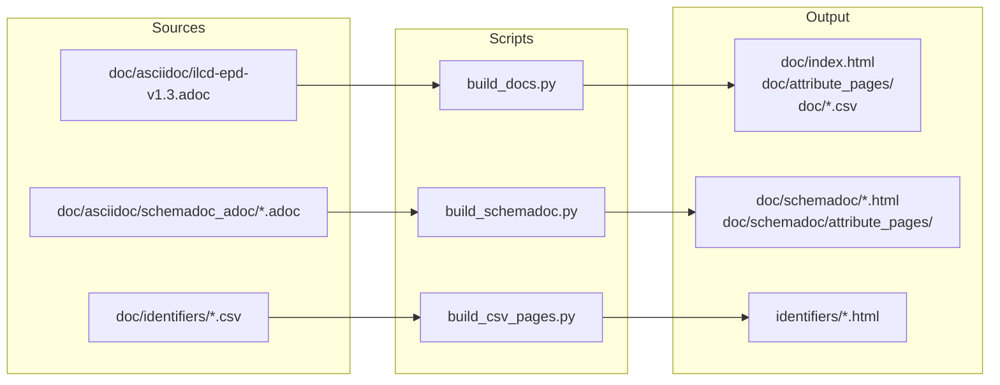

# GitHub Actions Workflows

Documentation is automatically built and deployed to GitHub Pages at:
`https://indatawg.github.io/ILCD-EPD-Data-Format/`

## Data Flow



## Build Architecture

### Build Scripts

All scripts are in `.github/build/` and use the shared `lib/parser.py` module.

**`build_docs.py`**
- Input: `doc/asciidoc/ilcd-epd-v1.3.adoc`
- Parses AsciiDoc table using `##cell##` delimiter format
- Detects enum groups (rows where datatype matches `^[A-Z] - `)
- Renders templates: `index.html.j2`, `attribute_page.html.j2`, `attribute_index.html.j2`
- Output: `doc/index.html`, `doc/attribute_pages/*.html`, `doc/ilcd-epd-v1.3.csv`, `doc/css/`, `doc/js/`

**`build_schemadoc.py`**
- Input: `doc/asciidoc/schemadoc_adoc/*.adoc` (all schema files)
- Extracts document title from `= Title` header lines
- Builds hierarchical structure with breadcrumbs and child element detection
- Renders templates: `schemadoc.html.j2`, `schemadoc_attribute.html.j2`
- Output: `doc/schemadoc/{schema}.html`, `doc/schemadoc/attribute_pages/*.html`, `doc/schemadoc/data/*.adoc`

**`build_csv_pages.py`**
- Usage: `python build_csv_pages.py <output_dir>`
- Input: `doc/identifiers/*.csv`
- Renders template: `csv_table.html.j2`
- Output: `<output_dir>/*.html` (one HTML file per CSV)

### Shared Library (`lib/parser.py`)

| Function | Description |
|----------|-------------|
| `parse_asciidoc_table(filename, pattern)` | Parses AsciiDoc tables with `##cell##` delimiters. Returns pandas DataFrame. Removes `{nbsp}` artifacts, strips whitespace, converts `Indent` column to numeric. Default pattern: `.EPD Data Structure` |
| `extract_title_from_adoc(filename)` | Extracts document title from `= Title` line. Strips " Documentation" suffix. Falls back to filename if not found. |
| `sanitize_filename(path)` | Converts hierarchical paths to safe filenames. `Process/CompanyName/Name` → `Process_CompanyName_Name.html` |

### Jinja2 Templates

Located in `.github/build/templates/`:

| Template | Used By | Description |
|----------|---------|-------------|
| `base.html.j2` | All | Base HTML structure with common head/scripts |
| `index.html.j2` | build_docs | Main table with search, language filters, column toggles, CSV/AsciiDoc download |
| `attribute_page.html.j2` | build_docs | Single attribute detail page |
| `attribute_index.html.j2` | build_docs | Index listing all attribute pages |
| `schemadoc.html.j2` | build_schemadoc | Schema table with hierarchical navigation |
| `schemadoc_attribute.html.j2` | build_schemadoc | Schema element detail with breadcrumbs and child elements |
| `csv_table.html.j2` | build_csv_pages | CSV data as filterable HTML table |

### Static Assets

- `css/style.css` - Unified styling for all pages
- `js/script.js` - Main table interactivity (search, filters, downloads)
- `js/schemadoc_script.js` - Schema documentation navigation
- `js/attribute_script.js` - Attribute page features

### Dependencies

```
pandas==2.2.0      # DataFrame operations, CSV handling
openpyxl==3.1.2    # Excel file support
Jinja2==3.1.2      # HTML template rendering
```

## Workflows

### Build and Deploy Documentation (`build-and-deploy.yml`)

**Triggers:**
- Push to any branch (when `doc/` or `.github/build/` changes)
- Manual `workflow_dispatch`

**Steps:**
1. Updates README links to use current branch name
2. Sets up Python 3.10 with pip caching
3. Installs dependencies from `requirements.txt`
4. Runs `build_docs.py` → main documentation
5. Runs `build_schemadoc.py` → schema documentation
6. Creates `gitBranches/{branch}/` with schemadoc and identifiers
7. Runs `build_csv_pages.py` → CSV-to-HTML for branch
8. Creates `/data/` with legacy filenames for backwards compatibility

**Deployment (uses `peaceiris/actions-gh-pages@v4`):**
- `/data/` → legacy download links (main/release branches only)
- `/doc/` → main documentation (main/release branches only)
- `/gitBranches/{branch}/` → branch preview (all branches)

### Cleanup Branch Documentation (`cleanup.yml`)

**Triggers:** Branch deletion

**Action:** Removes `/gitBranches/{branch}/` directory from `gitActions` branch.

### Create Version and Release (`version_release.yml`)

**Triggers:** Version tags (`v*.*.*` or `v*.*`)

**Action:**
- Creates ZIP package of repository
- Copies documentation to `/doc/releases/{version}/`
- Generates version landing page with download links
- Updates README.md with new version link

## Directory Structure on GitHub Pages

```
/ (gitActions branch)
├── data/                              # Legacy download files
│   ├── epd_documentation.csv
│   └── epd_documentation_from_xlsx_combined.adoc
├── doc/                               # Main documentation
│   ├── index.html
│   ├── ilcd-epd-v1.3.csv
│   ├── attribute_pages/
│   ├── schemadoc/
│   │   ├── {schema}.html
│   │   ├── attribute_pages/
│   │   ├── data/                      # Source .adoc files
│   │   ├── css/
│   │   └── js/
│   ├── css/
│   ├── js/
│   └── releases/{version}/
└── gitBranches/{branch}/              # Branch previews
    ├── schemadoc/
    └── identifiers/
```

## Local Testing

```bash
cd .github/build
pip install -r requirements.txt

python build_docs.py                                    # Main documentation
python build_schemadoc.py                               # Schema documentation
python build_csv_pages.py ../../doc/identifiers         # CSV tables

# View results: open doc/index.html in browser
```

## Troubleshooting

**"Could not find table matching..."** (build_docs.py)
- Check AsciiDoc file has `.EPD Data Structure` table header

**"Could not parse the table header"** (build_docs.py)
- Verify table uses `##cell##` delimiter format

**"Schemadoc source directory not found"** (build_schemadoc.py)
- Ensure `doc/asciidoc/schemadoc_adoc/` exists with `.adoc` files

**"Usage: python build_csv_pages.py <output_dir>"** (build_csv_pages.py)
- Output directory argument is required

**Jinja2 TemplateNotFound**
- Check `.github/build/templates/` contains required `.j2` files

**Documentation not updating on GitHub Pages**
- Check workflow run logs in Actions tab
- Verify `gitActions` branch exists
- Ensure GitHub Pages serves from `gitActions` branch

## Maintenance

### Updating Dependencies

Dependencies are checked by Dependabot. To manually update:
```bash
pip install --upgrade pandas openpyxl jinja2
pip freeze > requirements.txt
```

### Adding New Documentation

1. Add source files to `doc/asciidoc/` or `doc/asciidoc/schemadoc_adoc/`
2. Update Python scripts if schema changes
3. Test locally
4. Push - workflows build and deploy automatically
