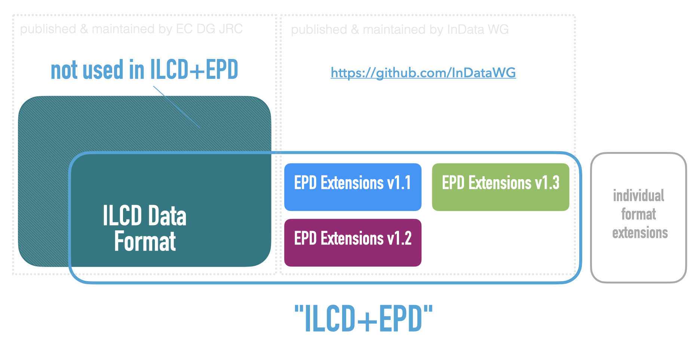

*document version 1.0*

# Migration Guide for ILCD+EPD data format from version 1.2 to 1.3

## Introduction

The v1.3 revision of the ILCD+EPD format specification adds a few more metadata fields that add information mandated by the EN 15804+A2 and/or ISO 22057 standards. This guide aims at summarizing the changes to the specification. 

## Full backward compatibility

Unlike with the 1.2 release, the v1.3 specification is fully backward compatible with the preceding version (v1.2) of the specification. Only new fields have been added.

## Namespaces

What is usually referred to as ILCD+EPD data format is more precisely the ILCD data format with extensions for EPDs. Each of these extensions has their own namespace. There is a number of items present in the original ILCD format which are not being used in ILCD+EPD.

For the new v1.3 revision, yet some more information items are being added in a new namespace.

### Namespace URIs

The namespace URIs for the original ILCD format are

- `http://lca.jrc.it/ILCD/Common`

- `http://lca.jrc.it/ILCD/Process`

- `http://lca.jrc.it/ILCD/Flow` 

etc.

The namespace URI for the EPD extensions from the v1.1 of the specification is `http://www.iai.kit.edu/EPD/2013` .

The namespace URI for items introduced with v1.2 of the EPD extensions is `http://www.indata.network/EPD/2019` .

The namespace URI for the new items introduced with v1.3 of the EPD extensions is `http://www.indata.network/EPD/2024` .

### Format version

To indicate a dataset is conforming to the v1.3 format specification, the *EPD format version* field (*@epd-version* attribute on the root element of a process dataset, introduced in v1.2) is used with the value `1.3`.

## Changes in v1.3

This section summarizes the additions to the schemas. See the schema documentation for all the details. 

### New fields in v1.3

A number of new metadata fields has been added:

*process (EPD) dataset:*

- Product Ids
- Manufacturers/Sites
- (Referenced/Estimated) Service Life 
- Variability
- Scenario Data
- Expiration Date of EPD
- SVHC
- PCR Compliance

*contact dataset:*

- Entity IDs

## Reference data

The reference data is maintained in the ILCD-EPD-Master-Data repository at https://github.com/InDataWG/ILCD-EPD-Master-Data/ and can also be obtained from the REFERENCE_DATA data stock on the InData node available at
https://data.indata.network/resource/datastocks/67a67abd-13b6-4a26-a166-5be16cd8feda (REST API)

https://data.indata.network/resource/datastocks/67a67abd-13b6-4a26-a166-5be16cd8feda/export (download as ZIP archive)